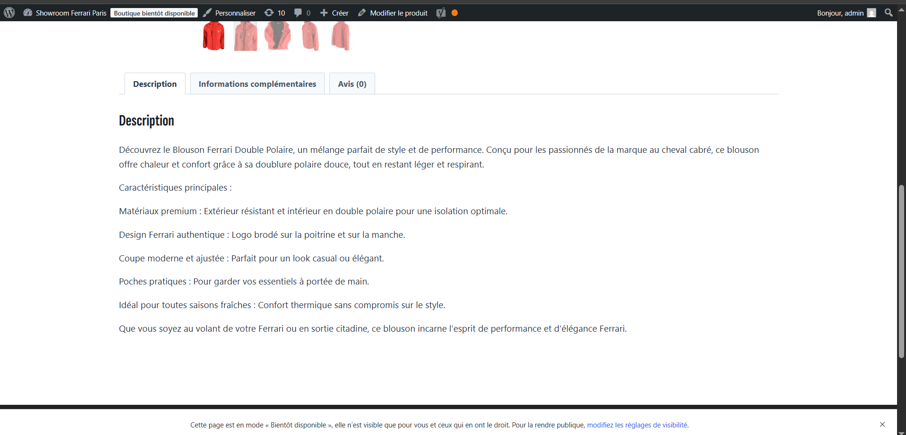

# Ferrari Paris Showroom 🏎️ - WordPress Showcase

This project is an immersive digital showcase dedicated to the Ferrari universe, designed to provide a premium and seamless user experience. It features a high-end catalog developed with **WordPress**, highlighting iconic models and an integrated accessory boutique.

## 🚀 Project Overview
The website is structured to captivate users from the homepage using a clean design, high-definition visuals, and intuitive navigation.

### Key Features:
* **Dynamic Model Catalog:** Detailed presentation of exceptional vehicles (Daytona SP3, SF90, Purosangue, LaFerrari) with technical descriptions.
* **E-commerce Integration:** Fully functional shop section powered by **WooCommerce** (e.g., Ferrari Double Fleece Jacket) featuring product descriptions and customer reviews.
* **Customer Engagement:** Exclusive newsletter subscription module and call-to-action for test drive bookings.
* **Responsive Design:** Modern UI optimized for a smooth experience across all devices.

---

## 🛠️ Technical Stack
* **CMS:** WordPress
* **E-commerce:** WooCommerce
* **Frontend:** Custom CSS for brand identity alignment, HTML5, JavaScript.
* **Design/UI:** Advanced theme customization and visual asset processing.

---

## 📸 Screenshots
## 📸 Screenshots
> *Visual overview of the interface.*

| Home Page | Product Details |
| :--- | :--- |
|  |  |

## 📖 Installation & Usage
*This repository contains the **custom theme files** and configuration for the project.*

1. Install a local WordPress instance.
2. Clone this repository into your `/wp-content/themes/` directory.
3. Activate the theme via the WordPress Dashboard.
4. (Optional) Install the WooCommerce plugin to enable the shop features.

---
